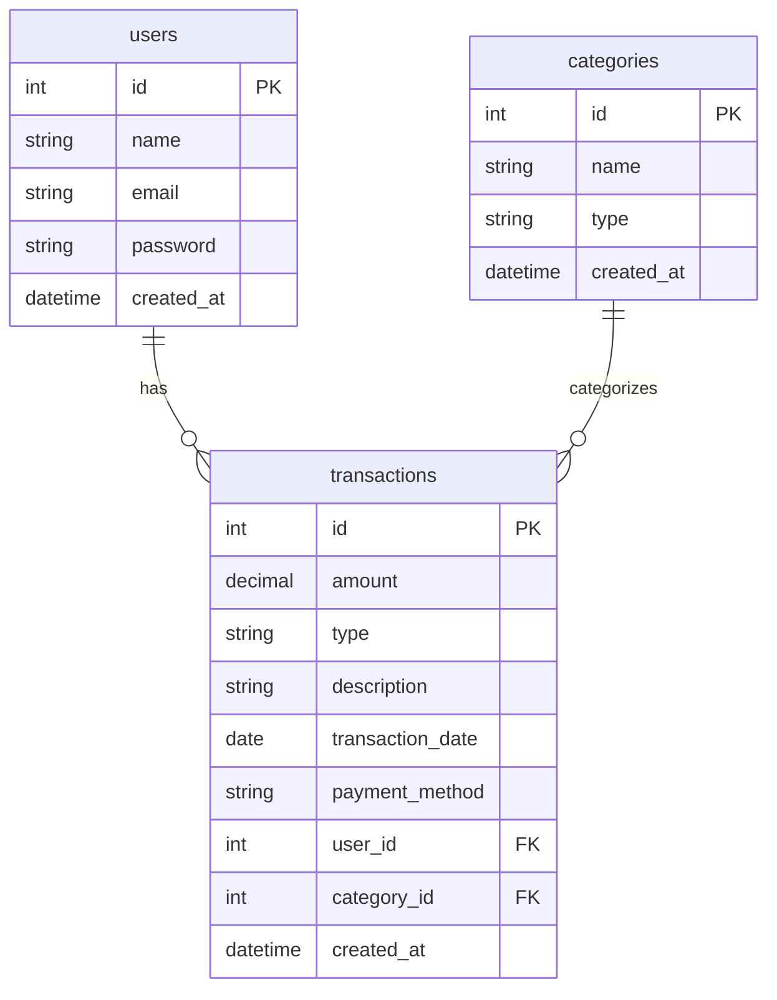

# Expense Tracker

Full-stack expense tracking application built with Spring Boot and React.

## Features
- User authentication (register, login, JWT)
- Transaction management (CRUD with filtering, pagination, sorting)
- Category management
- Interactive dashboard with charts (Recharts)
- Reports (daily, weekly, monthly, yearly, custom range)
- Data export (CSV, Excel, PDF)
- Responsive design
- User data isolation (multi-tenant security)

## Architecture
```
Client (React) → REST API (Spring Boot) → MySQL Database
```

Clean architecture: Controller → Service → Repository → Database

## Technology Stack
### Backend
- Java 21
- Spring Boot 3.3.2
- Spring Security + JWT
- Spring Data JPA
- MySQL
- Maven
- SpringDoc OpenAPI (Swagger)

### Frontend
- React 18
- Vite
- React Router v6
- Axios
- Recharts
- React Icons

### Testing
- JUnit 5
- Mockito
- Spring Boot Test
- H2 (in-memory for tests)

## Project Structure
```
expense-tracker/
├── backend/
│   ├── src/
│   │   ├── main/java/com/expensetracker/
│   │   └── test/java/com/expensetracker/
│   └── pom.xml
├── frontend/
│   ├── src/
│   ├── package.json
│   └── vite.config.js
├── database/
│   └── seed.sql
├── .env.example
└── README.md
```

## Database Design


## Prerequisites
- Java 21+
- Node.js 18+
- MySQL 8+
- Maven 3.9+

## Environment Setup
1. Copy .env.example to .env
2. Update database credentials
3. Set a strong JWT secret

## Database Setup
```bash
mysql -u root -p
CREATE DATABASE expense_tracker;
exit;

# Optional: Load seed data
mysql -u root -p expense_tracker < database/seed.sql
```

## Backend Setup
```bash
cd backend
# Set environment variables or use defaults
mvn clean install
mvn spring-boot:run
```
Backend runs at: http://localhost:8080
Swagger UI: http://localhost:8080/swagger-ui.html

## Frontend Setup
```bash
cd frontend
npm install
npm run dev
```
Frontend runs at: http://localhost:5173

## Running Tests
```bash
cd backend
mvn test
```

## API Documentation
Access Swagger UI at: http://localhost:8080/swagger-ui.html

### API Endpoints Summary
| Method | Endpoint | Description |
|--------|----------|-------------|
| POST | /api/auth/register | Register a new user |
| POST | /api/auth/login | Login and get JWT |
| GET | /api/transactions | Get all transactions |
| POST | /api/transactions | Create a transaction |
| PUT | /api/transactions/{id} | Update a transaction |
| DELETE | /api/transactions/{id} | Delete a transaction |
| GET | /api/dashboard/summary | Get dashboard overview |

## Demo Credentials
- Email: demo@example.com
- Password: demo123

## Build for Production
### Backend
```bash
cd backend
mvn clean package -DskipTests
java -jar target/expense-tracker-0.0.1-SNAPSHOT.jar
```

### Frontend
```bash
cd frontend
npm run build
```
